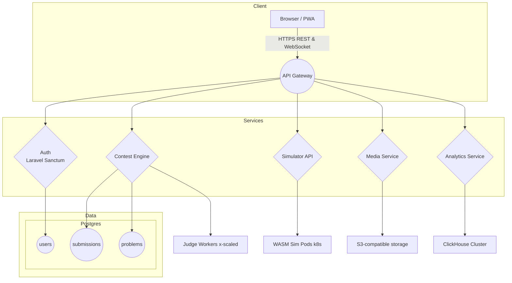

# RoboContest.uz | President Tech Awards 2025 Submission

> **Transforming classrooms into innovation hubs by making robotics and coding competitions accessible to every student in Uzbekistan and beyond.**

---

## About

RoboContest.uz is Uzbekistan’s first **end-to-end online platform** for robotics and coding contests. It provides:

* Curriculum-aligned coding and hardware challenges  
* In-browser simulators for Arduino, ESP32, and AVR 8-bit CPUs—**no hardware barrier** for beginners  
* National competitions culminating in **offline RoboFest finals**

Self-hosted on **Proxmox** in Tashkent, the platform is built by local educators and engineers who believe world-class STEM education should be *born-local and stay-local*.

---

## Why It Matters

| Challenge                               | Our Solution                                      |
| --------------------------------------- | ------------------------------------------------- |
| Rural schools lack robotics labs        | Browser-based simulators + low-cost hardware kits |
| Limited mentorship outside major cities | Asynchronous video courses & AI-driven feedback   |
| Lack of Uzbek-language STEM resources   | Full Uzbek localization & bilingual content       |
| Gender gap in tech                      | Targeted outreach, girls-only monthly challenges  |

**Impact so far (Jun 2025)**  

* **21 000+** registered students from **14** regions  
* **380** schools onboarded, **42 %** outside regional centers  
* **6 TB** of code submissions auto-assessed with ≤ 300 ms latency  

---

## Business Perspective

<details>
<summary>Click to expand</summary>

### Market Opportunity
* **3.4 million** secondary-school students in Uzbekistan; STEM budgets expanding at **≥ 18 % CAGR**  
* Central-Asia EdTech TAM estimated at **US $120 million** by 2028  

### Revenue Streams (2026 Plan)

| Stream                                 | Target Segment       | Share |
| -------------------------------------- | -------------------- | ----- |
| Freemium Premium (₮20 k – 30 k UZS/mo) | Students & Parents   | 35 %  |
| B2B SaaS School Licenses               | Schools & Lyceums    | 25 %  |
| Corporate Sponsorship / CSR            | Tech & Telecom       | 20 %  |
| Contest Entry Fees                     | Universities & Clubs | 10 %  |
| Branded Hardware Kits                  | Retail & Online      | 10 %  |

### Competitive Advantage
Localization, browser-first simulation, AI-assisted feedback, and deep community ties.

</details>

---

## Technical Overview

### Technology Stack

| Layer                 | Tech                                                                     |
| --------------------- | ------------------------------------------------------------------------ |
| Front-End             | **Vue 3**, Nuxt 3, Tailwind CSS, ShadCN, Vite, Vitest                    |
| Back-End (Contest)    | **Laravel 11** PHP 8.3, PostgreSQL 16, Redis 7                           |
| Back-End (Simulation) | Node.js 20 + NestJS micro-services                                       |
| Hardware Sim Core     | TypeScript → WebAssembly (Rust-compiled AVR / Xtensa cores)              |
| Message Bus           | NATS JetStream + BullMQ for background jobs                              |
| DevOps                | Docker Compose / Buildx, Traefik v3, Proxmox VE 8, OPNsense → WireGuard  |
| AI Services           | Whisper-Medium-Uz (fine-tuned), VITS Uz TTS, Qwen 2.5 0.5 B LLM via vLLM |
| Observability         | Prometheus + Grafana, Loki, Alertmanager, Sentry SaaS                    |
| CI / CD               | GitHub Actions → self-hosted runners on Proxmox                           |

### System Architecture



### Repository Layout

```
├─ apps/
│  ├─ api/                # Laravel source
│  ├─ simulator-api/      # NestJS gateway
│  ├─ judge-worker/       # Rust + Tokio sandbox
│  └─ front/              # Nuxt 3 SPA
├─ libs/
│  ├─ wasm-cores/         # AVR & Xtensa Wasm builds
│  └─ shared/             # TypeScript DTOs & utilities
├─ docker/
│  └─ compose/            # Service definitions
├─ .github/workflows/     # CI pipelines
└─ docs/                  # Architecture & ADRs

```

### Setup & Configuration

#### Prerequisites

-   **CPU:** 8 cores + (dev), AVX2-capable

-   **RAM:** 16 GB minimum

-   **Docker 20.10 +** with Compose v2

-   **Node 20** and **PNPM 8** (optional for PWA work)

-   **PHP 8.3** (CLI) + Composer 2

_Hot-reload_: Vite HMR on front-end; Laravel Octane on back-end  
_Dev container_: `.devcontainer.json` for one-click VS Code setup

### CI / CD Pipeline

Stage

Tool

Key Steps

**Build**

GitHub Actions

Lint → Unit tests → Docker buildx (multi-arch)

**Scan**

Trivy

SCA + image vulnerability scan

**Push**

GitHub Container Registry

Tags `edge`, `staging`, `prod`

**Deploy**

Argo CD

Watches `staging` & `prod` Helm charts

**Smoke Tests**

k6

API latency & error-budget checks

### Security & Compliance

-   **Sandboxing** – Judge executes untrusted code in gVisor + seccomp-restricted namespace

-   **Network Policy** – Cilium enforces zero-trust between pods

-   **Data** – All PII encrypted in PostgreSQL tables (pgcrypto)

-   **Compliance** – Roadmap for ISO 27001 & local Law 229


### Observability

-   **Metrics** – Prometheus exporters (Laravel, Node, NATS)

-   **Logs** – Loki aggregates JSON logs, Grafana dashboards pre-built

-   **Tracing** – OpenTelemetry → Tempo (judge latency traces)

-   **Alerts** – Alertmanager routes to Telegram Ops channel


### Testing Strategy

Level

Framework

Notes

Unit

Vitest (front), Pest PHP (api), Jest (sim)

> 80 % coverage gate

Integration

Laravel Testbench, Supertest

API contracts vs PG/Redis test containers

E2E

Playwright

Headless Chromium PWA, runs nightly

Load

k6

500 concurrent submissions, p95 < 500 ms

### Deployment Guide

1.  **Provision** a Proxmox cluster (≥ 2× nodes, ZFS RAID-10)

2.  **Bootstrap** a Debian 12 VM → install K3s (high-availability)

3.  **Install** Longhorn for PVs + Ceph RGW for S3-compatible storage

4.  **Import** `infra/helm/` charts into Argo CD, sync to `staging`

5.  **Verify** Grafana dashboards, then promote to `prod`


----------

## Roadmap 2025 → 2026

-   ⏳ **PWA Offline Mode** _(Q3 2025)_

-   ⏳ **Teacher Assignment Builder** _(Q4 2025)_

-   ⏳ **Multi-robot Simulation** _(Q1 2026)_

-   ⏳ **Public API / SDK** _(Q2 2026)_


----------

## Impact & Metrics

Metric

Value (Jun 2025)

Source

Registered Users

**121 k**

PostgreSQL

Daily Submissions

**11 500**

Redis counter

Avg. Judge Latency

**290 ms** p95

Prometheus

Female Participation

**38 %**

Survey

Rural Schools Onboarded

**120**

MoE MOU

----------

## Contact & Support

-   **Website:** [https://robocontest.uz](https://robocontest.uz/)

-   **Telegram:** [@robocontest_uz](https://t.me/robocontest)


----------

_Made with ❤️ in Uzbekistan by the RoboContest team._
